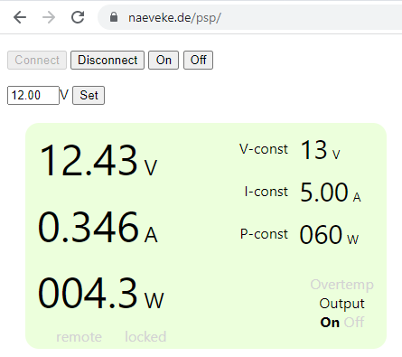

# PSP.js
Browser based remote control for GW-Instek PSP power supplies.

[Watch video](https://www.tiktok.com/@thenitek/video/7061538243711339782)

# Howto
* Open index.html from you localhost or [anywhere with HTTPS](https://naeveke.de/psp/) (without HTTPS browsers do not allow to access the COM ports!)
* Click connect and choose the COM port of your PSP
* Have fun

# Disclaimer
This is not an officiall GW-Instek product.
Use at your own risk.
